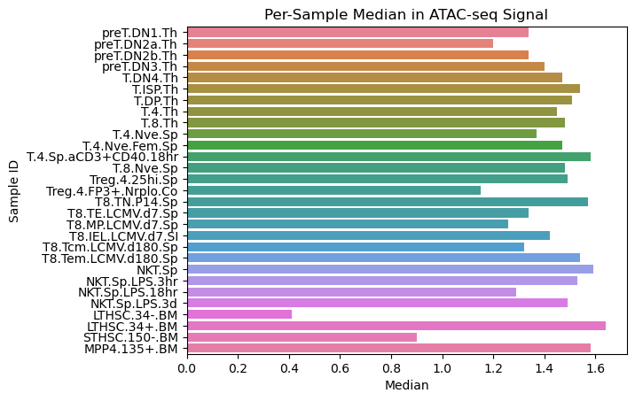
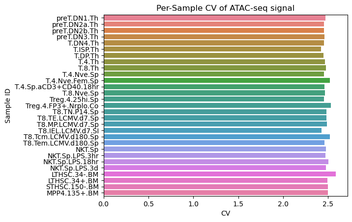

# ATAC-seq Signal Processing 

This part of the project focuses on:

- Wrangling ATAC-seq signal data 
- Analyzing signal variability across samples 

The goal is to transform the raw ATAC-seq signal matrix into a tidy format and then assess per-sample variability (mean, median, standard deviation, CV).

---

## Part 1 – ATAC-seq Wrangling 

### Input
- **Folder:** `ATAC-seq/`
- Contains all raw and intermediate ATAC-seq files used for wrangling: 

- `ATAC-seq data.csv`: Original wide-format signal matrix (rows = peaks, columns = all samples). Not modified to avoid accidental deletion.
- `filtered_ATAC_abT_Tact_Stem.csv`: Subset of the original matrix, keeping only columns related to abT and T.act cell types.
- `refined_ATAC.csv`: Tidy-format table with selected samples and peaks reshaped into three columns: `peakID`, `SampleID`, and `Signal`.

### Method
1. **Filter for abT and T.act samples**
   - File used: `filtered_ATAC_abT_Tact_Stem.csv`
   - Only keeps columns corresponding to abT and T.act cell types.

2. **Refine and reshape**
   - File: `refined_ATAC.csv`
   - Reformats the data to include:
     - `peakID`
     - `SampleID`
     - `Signal`
   - Puts sample type (abT or T.act) and signal values into two columns (long format).

### Output
- **Final output:** `refined_ATAC.csv`  
- This tidy-format file will be used for variability analysis in the next step. 

---

---

## Part 2 – Signal Variability Analysis 

### Input
- **File:** `refined_ATAC.csv`  
  - Output from Part 1's wrangling step, containing tidy ATAC-seq signal values.

### Method
1. **Library Imports:**
   - Used `pandas`, `numpy`, `matplotlib`, `seaborn`, and `scanpy` for analysis and visualization.

2. **Data Loading:**
   - Loaded `refined_ATAC.csv` as a DataFrame for downstream analysis.

3. **Descriptive Statistics:**

Performed basic descriptive statistics to assess the distribution and variability of chromatin accessibility signals across all 29 samples (cell types). The minimum and maximum signal values in the dataset were found to be:

- **Min Signal:** 0.1  
- **Max Signal:** 727.42  

   - Computed per-sample statistics for the `Signal` column:
     - **Mean**
     - **Median**
     - **Standard Deviation (SD)**
     - **Coefficient of Variation (CV)** (calculated as `SD / Mean`)
   

<<<<<<< HEAD
</style>
=======
>>>>>>> ATAC-seq-wrangling
<table border="1" class="dataframe" style="margin-left: auto; margin-right: auto;">
  <thead>
    <tr style="text-align: right;">
      <th></th>
      <th>Sample ID</th>
      <th>Mean</th>
      <th>Median</th>
      <th>SD</th>
      <th>CV</th>
    </tr>
  </thead>
  <tbody>
    <tr>
      <th>0</th>
      <td>preT.DN1.Th</td>
      <td>4.006249</td>
      <td>1.34</td>
      <td>9.896460</td>
      <td>2.470256</td>
    </tr>
    <tr>
      <th>1</th>
      <td>preT.DN2a.Th</td>
      <td>4.009777</td>
      <td>1.20</td>
      <td>9.849384</td>
      <td>2.456342</td>
    </tr>
    <tr>
      <th>2</th>
      <td>preT.DN2b.Th</td>
      <td>4.001368</td>
      <td>1.34</td>
      <td>9.831580</td>
      <td>2.457055</td>
    </tr>
    <tr>
      <th>3</th>
      <td>preT.DN3.Th</td>
      <td>3.999144</td>
      <td>1.40</td>
      <td>9.830203</td>
      <td>2.458077</td>
    </tr>
    <tr>
      <th>4</th>
      <td>T.DN4.Th</td>
      <td>4.000097</td>
      <td>1.47</td>
      <td>9.819900</td>
      <td>2.454915</td>
    </tr>
    <tr>
      <th>5</th>
      <td>T.ISP.Th</td>
      <td>3.990197</td>
      <td>1.54</td>
      <td>9.660167</td>
      <td>2.420975</td>
    </tr>
    <tr>
      <th>6</th>
      <td>T.DP.Th</td>
      <td>4.002725</td>
      <td>1.51</td>
      <td>9.797414</td>
      <td>2.447686</td>
    </tr>
    <tr>
      <th>7</th>
      <td>T.4.Th</td>
      <td>3.984623</td>
      <td>1.45</td>
      <td>9.828451</td>
      <td>2.466595</td>
    </tr>
    <tr>
      <th>8</th>
      <td>T.8.Th</td>
      <td>3.988538</td>
      <td>1.48</td>
      <td>9.886826</td>
      <td>2.478810</td>
    </tr>
    <tr>
      <th>9</th>
      <td>T.4.Nve.Sp</td>
      <td>3.996412</td>
      <td>1.37</td>
      <td>9.819407</td>
      <td>2.457056</td>
    </tr>
    <tr>
      <th>10</th>
      <td>T.4.Nve.Fem.Sp</td>
      <td>3.934404</td>
      <td>1.47</td>
      <td>9.928258</td>
      <td>2.523446</td>
    </tr>
    <tr>
      <th>11</th>
      <td>T.4.Sp.aCD3+CD40.18hr</td>
      <td>4.004715</td>
      <td>1.58</td>
      <td>9.851863</td>
      <td>2.460066</td>
    </tr>
    <tr>
      <th>12</th>
      <td>T.8.Nve.Sp</td>
      <td>4.000576</td>
      <td>1.48</td>
      <td>9.876306</td>
      <td>2.468721</td>
    </tr>
    <tr>
      <th>13</th>
      <td>Treg.4.25hi.Sp</td>
      <td>3.983050</td>
      <td>1.49</td>
      <td>9.770408</td>
      <td>2.452997</td>
    </tr>
    <tr>
      <th>14</th>
      <td>Treg.4.FP3+.Nrplo.Co</td>
      <td>3.900618</td>
      <td>1.15</td>
      <td>9.873799</td>
      <td>2.531342</td>
    </tr>
    <tr>
      <th>15</th>
      <td>T8.TN.P14.Sp</td>
      <td>3.982565</td>
      <td>1.57</td>
      <td>9.886799</td>
      <td>2.482520</td>
    </tr>
    <tr>
      <th>16</th>
      <td>T8.TE.LCMV.d7.Sp</td>
      <td>3.976135</td>
      <td>1.34</td>
      <td>9.880270</td>
      <td>2.484893</td>
    </tr>
    <tr>
      <th>17</th>
      <td>T8.MP.LCMV.d7.Sp</td>
      <td>3.962223</td>
      <td>1.26</td>
      <td>9.857753</td>
      <td>2.487935</td>
    </tr>
    <tr>
      <th>18</th>
      <td>T8.IEL.LCMV.d7.SI</td>
      <td>3.992190</td>
      <td>1.42</td>
      <td>9.696283</td>
      <td>2.428813</td>
    </tr>
    <tr>
      <th>19</th>
      <td>T8.Tcm.LCMV.d180.Sp</td>
      <td>3.936356</td>
      <td>1.32</td>
      <td>9.930768</td>
      <td>2.522833</td>
    </tr>
    <tr>
      <th>20</th>
      <td>T8.Tem.LCMV.d180.Sp</td>
      <td>3.984894</td>
      <td>1.54</td>
      <td>9.810291</td>
      <td>2.461870</td>
    </tr>
    <tr>
      <th>21</th>
      <td>NKT.Sp</td>
      <td>3.978282</td>
      <td>1.59</td>
      <td>9.863354</td>
      <td>2.479300</td>
    </tr>
    <tr>
      <th>22</th>
      <td>NKT.Sp.LPS.3hr</td>
      <td>3.989211</td>
      <td>1.53</td>
      <td>9.864762</td>
      <td>2.472860</td>
    </tr>
    <tr>
      <th>23</th>
      <td>NKT.Sp.LPS.18hr</td>
      <td>3.955158</td>
      <td>1.29</td>
      <td>9.903218</td>
      <td>2.503874</td>
    </tr>
    <tr>
      <th>24</th>
      <td>NKT.Sp.LPS.3d</td>
      <td>3.990898</td>
      <td>1.49</td>
      <td>9.884233</td>
      <td>2.476694</td>
    </tr>
    <tr>
      <th>25</th>
      <td>LTHSC.34-.BM</td>
      <td>3.868438</td>
      <td>0.41</td>
      <td>10.004101</td>
      <td>2.586083</td>
    </tr>
    <tr>
      <th>26</th>
      <td>LTHSC.34+.BM</td>
      <td>4.005767</td>
      <td>1.64</td>
      <td>9.986633</td>
      <td>2.493064</td>
    </tr>
    <tr>
      <th>27</th>
      <td>STHSC.150-.BM</td>
      <td>4.001125</td>
      <td>0.90</td>
      <td>9.991892</td>
      <td>2.497271</td>
    </tr>
    <tr>
      <th>28</th>
      <td>MPP4.135+.BM</td>
      <td>4.002324</td>
      <td>1.58</td>
      <td>9.994831</td>
      <td>2.497257</td>
    </tr>
  </tbody>
</table>

Globally speaking, there is not much of a difference between the cell types. The values are almost identical, which leads us to a possible conclusion that minimal changes in chromatin accessibility (i.e. individual enhancers) may be what differentiates the cell types. 

**Fig. 1: Mean values of ATAC-seq peak signal in progenitor, abT and T-act cells.** The values of the mean signal in all cell types lie around 4.0. Little difference between the cell types can be observed.

**Fig. 2: Median values of ATAC-seq peak signal in progenitor, abT, and T.act cells.** The median values for all cell types are fairly low and lie between 0.4 and a little over 1.6.

**Fig. 3: Coefficient of variance (CV) values of ATAC-seq peak signals in progenitor, abT, and T.act cells.** The CVs of all cell types are quite similar with a value of around 2.5.

Plotting the mean (Fig. 1) confirms that the signal values across peaks are generally low and fairly similar to each other. This result is plausible, as there are more than 500.000 peaks being examined across 20 chromosomes, and tells us that differences that occur between cell types should be examined locally. 

The median (Fig. 2) shows values between 0.4 and around 1.6. This indicates that most of the values are quite small, however unlike the mean here some kind of variance can be observed. Whether the difference here is significant on a global should be examined further.

When it comes to the coefficient of variance or CV (Fig. 3), the bar plot is really similar to the mean. There are not any major differences between the cell types with the value being around 2.5 in all cases. 

___

### Summary

To summarize, after loading and inspecting the refined ATAC-seq data basic statistical methods were employed. The mean and the CV did not show any noticeable differences between cell types. However, the median was more variable and could potentially be relevant when it comes to overall chromatin accessibility. Nevertheless, all values were fairly low when compared to the maximal signal atained (727.42). 

These results suggest that the global structure of chromatin does not differ significantly across cell types. Instead, it is quite possible that local changes in the accessibility of individual elements (e.g. enhancers) play an important role in the differentiation. Those claims are to be examined further in the following weeks together with the data on gene expression provided by RNA-seq.

