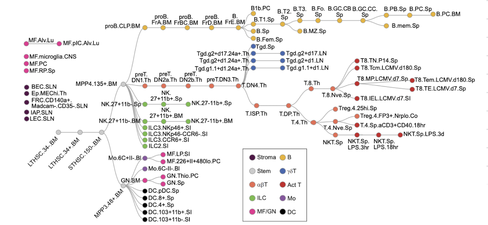
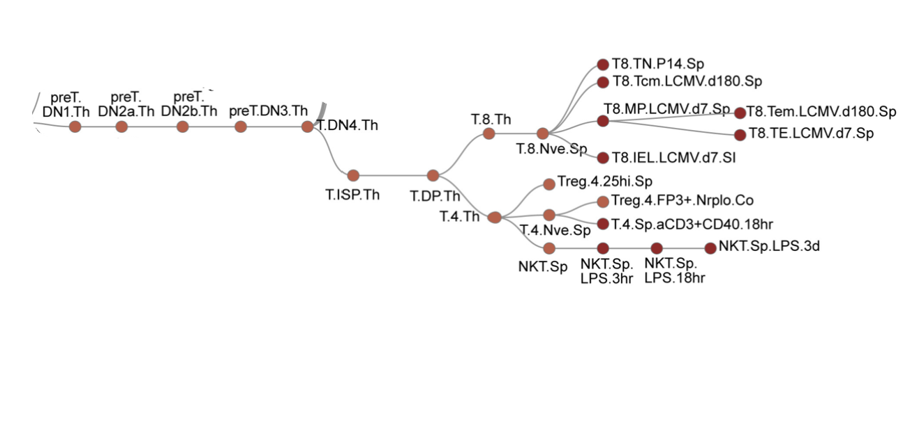
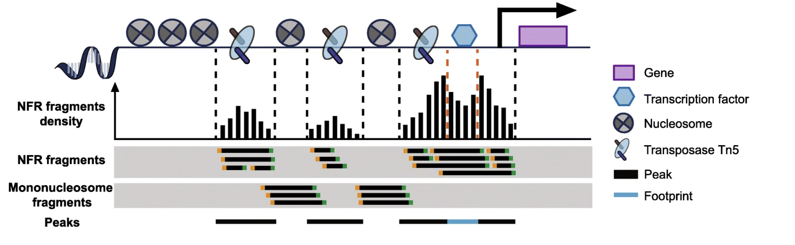
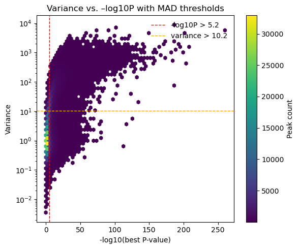

<h1 align="center">
   Determine Gene Regulation of Immune Cells  
   
  from Paired ATAC- and RNA-seq Data  
   
  <em>Group 2: abT & T.act cells</em>
</h1>

## 1. Overview

## 2. Project Description / Introduction
### **2.1 Immune Cell Types: αβ T Cells & Activated T Cells**

Our project focuses on two related immune cell types: αβ T cells (abT) and their activated counterparts (T.act). The specific cell types analyzed in this project were chosen based on their representation in the cis-regulatory atlas published by Yoshida et al. (2019), which serves as the foundational reference for our immune cell lineage structure.
  

  <figure style="flex: 1; margin: 0;">
    
    <figcaption><strong>Figure 1.</strong> <em>Full lineage map of mouse immune cells from:</em> 
    Yoshida, H., et al. (2019). <em>The cis–Regulatory Atlas of the Mouse Immune System.</em> Cell, 176(4), 897–912.e20.
    </figcaption>
  </figure>

  <figure style="flex: 1; margin: 0;">
    
    <figcaption><strong>Figure 2.</strong> <em>Highlighted subset of the Yoshida et al. lineage tree, showing only the abT and T.act cell branches analyzed in this project.</em></figcaption>
  </figure>

  

### <u>αβ T Cells (abT)</u>

**αβ T cells** are the major class of conventional T lymphocytes in the adaptive immune system. They express T-cell receptors (TCRs)composed of α and β chains, and differentiate into:

- **CD8⁺ cytotoxic T cells** — eliminate virus-infected or tumor cells  
- **CD4⁺ helper T cells** — secrete cytokines and coordinate immune responses

 Zhang, Y., et al. (2023).

### <u>Activated T Cells (T.act)</u>

Once stimulated by antigen, naive αβ T cells become activated and acquire effector functions:

- **Activated CD8⁺ T cells** become cytotoxic killers  
- **Activated CD4⁺ T cells** coordinate other immune cells via cytokine release

 Zhang, Y., et al. (2023)

---

### **2.2 ATAC-seq and RNA-seq: Purpose and Relevance**

To understand how abT and Tact cells regulate gene expression, we use data from two complementary technologies:

### <u> RNA-seq </u>
RNA sequencing measures gene expression by quantifying transcribed RNA molecules. It enables high-throughput, unbiased insights into:
- Cell differentiation
- Disease progression
- Functional genomics

However, RNA-seq alone does not reveal upstream chromatin structure or how gene expression is regulated.

### <u> ATAC-seq </u>
ATAC-seq (Assay for Transposase-Accessible Chromatin with sequencing) maps open chromatin regions by inserting sequencing adapters at accessible DNA sites using the Tn5 transposase.  
This lets us identify regulatory elements like promoters and enhancers.

Key advantages:
- Requires fewer cells
- Simpler, faster protocol
- High resolution of chromatin accessibility
- Allows inference of transcription factor binding and nucleosome positioning

The main idea is combining ATAC-seq and RNA-seq to allow us to reconstruct regulatory networks and track cell state transitions. In our study, this joint analysis helps us understand how different immune cell types specialize by using different regulatory DNA elements.

  

**Figure 3.** Schematic of ATAC-seq signal logic and components.  
*Source: Yan, F., et al. (2020). From reads to insight: a hitchhiker’s guide to ATAC-seq data analysis. Genome Biology, 21(22).*

- Reference datasets and articles (e.g., Yoshida et al., Sasse et al.) - what exactly??? 

### **2.4 Research Goals**

- we should write this down together because chatgpt is not helping... what exactly do we wanna list as our objectives??

## 3. Dependencies

maybe put a URL 
  - anndata=0.11.4=pyhd8ed1ab_0
  - array-api-compat=1.12.0=pyhe01879c_0
  - blas=1.0=openblas
  - bottleneck=1.4.2=py313ha35b7ea_0
  - brotli-python=1.0.9=py313h313beb8_9
  - bzip2=1.0.8=h80987f9_6
  - c-ares=1.34.5=h5505292_0
  - ca-certificates=2025.4.26=hbd8a1cb_0
  - colorama=0.4.6=pyhd8ed1ab_1
  - contourpy=1.3.1=py313h48ca7d4_0
  - cycler=0.11.0=pyhd3eb1b0_0
  - exceptiongroup=1.3.0=pyhd8ed1ab_0
  - expat=2.7.1=h313beb8_0
  - fonttools=4.55.3=py313h80987f9_0
  - freetype=2.13.3=h47d26ad_0
  - git-lfs=3.6.1=h55e91fe_0
  - h5py=3.12.1=py313h0957e0b_1
  - hdf5=1.14.5=hd77251f_2
  - icu=73.2=hc8870d7_0
  - joblib=1.5.0=pyhd8ed1ab_0
  - jpeg=9e=h80987f9_3
  - kiwisolver=1.4.8=py313h313beb8_0
  - krb5=1.20.1=h69eda48_0
  - lcms2=2.16=he26ebf3_1
  - legacy-api-wrap=1.4.1=pyhd8ed1ab_0
  - lerc=4.0.0=h313beb8_0
  - libcurl=8.12.1=hde089ae_0
  - libcxx=20.1.5=ha82da77_0
  - libdeflate=1.22=h80987f9_0
  - libedit=3.1.20191231=hc8eb9b7_2
  - libev=4.33=h93a5062_2
  - libffi=3.4.4=hca03da5_1
  - libgfortran=5.0.0=11_3_0_hca03da5_28
  - libgfortran5=11.3.0=h009349e_28
  - libhwloc=2.11.2=default_hbce5d74_1001
  - libiconv=1.18=hfe07756_1
  - libmpdec=4.0.0=h80987f9_0
  - libnghttp2=1.57.0=h62f6fdd_0
  - libopenblas=0.3.29=hea593b9_0
  - libpng=1.6.39=h80987f9_0
  - libssh2=1.11.1=h3e2b118_0
  - libtiff=4.7.0=h91aec0a_0
  - libwebp-base=1.3.2=h80987f9_1
  - libxml2=2.13.8=h0b34f26_0
  - llvm-openmp=20.1.5=hdb05f8b_0
  - llvmlite=0.44.0=py313heb35c27_1
  - lz4-c=1.9.4=h313beb8_1
  - matplotlib=3.10.0=py313hca03da5_1
  - matplotlib-base=3.10.0=py313hb68df00_0
  - natsort=8.4.0=pyh29332c3_1
  - ncurses=6.4=h313beb8_0
  - networkx=3.4.2=pyh267e887_2
  - numba=0.61.2=py313h8aea8d6_0
  - numexpr=2.10.1=py313h5d9532f_0
  - numpy=2.2.5=py313hdcf7240_0
  - numpy-base=2.2.5=py313h9d8309b_0
  - openjpeg=2.5.2=hba36e21_1
  - openssl=3.5.0=h81ee809_1
  - packaging=24.2=py313hca03da5_0
  - pandas=2.2.3=py313hcf29cfe_0
  - patsy=1.0.1=pyhd8ed1ab_1
  - pillow=11.1.0=py313h41ba818_1
  - pip=25.1=pyhc872135_2
  - pynndescent=0.5.13=pyhd8ed1ab_1
  - pyparsing=3.2.0=py313hca03da5_0
  - python=3.13.2=h4862095_100_cp313
  - python-dateutil=2.9.0post0=py313hca03da5_2
  - python-tzdata=2025.2=pyhd3eb1b0_0
  - python_abi=3.13=0_cp313
  - pytz=2024.1=py313hca03da5_0
  - readline=8.2=h1a28f6b_0
  - scanpy=1.11.1=pyhd8ed1ab_0
  - scikit-learn=1.5.2=py313h14e4f8e_1
  - scipy=1.15.3=py313hd7edaaf_0
  - seaborn=0.13.2=py313hca03da5_2
  - session-info2=0.1.2=pyhd8ed1ab_0
  - setuptools=72.1.0=py313hca03da5_0
  - six=1.17.0=py313hca03da5_0
  - sqlite=3.45.3=h80987f9_0
  - statsmodels=0.14.4=py313h93df234_0
  - tbb=2022.1.0=h9541205_0
  - threadpoolctl=3.6.0=pyhecae5ae_0
  - tk=8.6.14=h6ba3021_0
  - tornado=6.4.2=py313h80987f9_0
  - tqdm=4.67.1=pyhd8ed1ab_1
  - typing-extensions=4.13.2=h0e9735f_0
  - typing_extensions=4.13.2=pyh29332c3_0
  - tzdata=2025b=h04d1e81_0
  - umap-learn=0.5.7=py313h8f79df9_1
  - wheel=0.45.1=py313hca03da5_0
  - xz=5.6.4=h80987f9_1
  - zlib=1.2.13=h18a0788_1
  - zstd=1.5.6=hfb09047_0

## 4. Project Organization
We used the following notebooks in order to work on the tasks:

### **1. ATAC-seq wrangling**
This notebook prepares the ATAC-seq dataset for downstream analysis. It includes cell type annotation, filtering low-quality cells, normalization of signal values, and initial visual checks. The cleaned dataset serves as the foundation for all ATAC-based analyses in later steps. Note that this filtering was done not as the first task, but rather later on in the project as we saw multiple reasons to do the filtering this way, and later on we reran certain analyses. (see Results and Discussion -here we need to specify where exactly we talked ab this-)

### **2. Stat-ATAC**
To explore the distribution and structure of chromatin accessibility across immune cell types, we performed preliminary statistical analyses on the unfiltered ATAC-seq dataset. This included computing summary statistics and visualizing patterns using methods like bar plots. However, these initial results lacked biological clarity and interpretability. Based on these limitations, we later decided to filter and clean the ATAC dataset (the process documented in the first notebook) to enable more meaningful downstream analyses.

### **3. Stat-peaks**
to be honest im not sure if we should include this one, maybe we can merge it w the one above 

### **4. Q2_qc_vs_signal**
This notebook assessed the quality of the unfiltered ATAC-seq dataset by investigating potential correlations between signal intensity and various QC metrics (e.g. number of fragments, duplication rate). Overall data quality appeared good and we found little to no correlation between ATAC signal and QC metrics. 

### **5. TSS distance**
i dont think we should hand in this notebook, the reason i cannot delete this is because i did this one first and the first part worked perfectly, and we later used a file that we extracted from that code somewhere else so it has to stay.... i tried copying the new notebook into this one but it did not work (the code)

### **5. TSS distance New**
In this notebook we computed each peak’s distance to its nearest TSS, plotted the distance distribution, merged in mean ATAC signal, and assesed & plot  the signal–distance relationship using pearson.

### **6. Signal comparison**
This notebook represents an early attempt to classify regulatory elements as promoters or enhancers based solely on their distance to the transcription start site (TSS). Although we were aware that such a naive distance-based classification would likely be insufficient, this trial allowed us to explore the feasibility of this approach. The method was not robust or conclusive and ultimately was not used in downstream analyses.

### **7. ATAC Clustering Analysis**
This notebook contains the main ATAC-seq clustering analysis, performed on the filtered dataset. We reduced dimensionality using PCA, UMAP, and t-SNE, and visualized the accessibility profiles across immune cell types. Clustering patterns were inspected to assess whether related cell types (specifically, progenitor, αβ T cells, activated T cells) group together based on their chromatin accessibility. This analysis directly addressed our goal of defining similarities and differences in chromatin landscapes between cell types.

### **8. Gene-expression clustering week 3**
This notebook mirrors the ATAC-seq clustering approach, but applied to RNA-seq data. 

### **9. Compare atac rna**
In this notebook, we directly compared ATAC-seq and RNA-seq clustering results by aligning the dimensionality reduction plots (PCA, UMAP, t-SNE) of both datasets side by side. We matched and renamed cell types across datasets to unify labels and enable visual comparison. The aim was to assess whether chromatin accessibility and gene expression reflect similar relationships between immune cell types, and to what extent their clustering patterns overlap or diverge.

### **10. abT Tact gene clusters**
gene ontology but im not sure how to explain this 

### **11. CRE location and expression correlation**
This notebook explores the relationship between chromatin accessibility at cis-regulatory elements (CREs) and gene expression, with a focus on the distance to the transcription start site (TSS). We included both upstream and downstream regions in the correlation analysis to test how proximity and position relative to the TSS influence the association strength. The goal was to gain insight into spatial trends that might inform further CRE-gene linking strategies.

the rest idk rn 
### **12. CRE location counts (TBD)**
### **13. Regression model (TBD)**
### **4. Regression model (part 2) *about to be pushed* (TBD)**

## 5. Results
- Basic statistics and QC metrics

- Clustering of CREs and cell types
- Gene clustering and functional annotation
- Regression analysis and assignment of CREs to specific genes

## 6. Discussion

## 7. Resources 

1. Yoshida, H., et al. (2019). The cis-Regulatory Atlas of the Mouse Immune System. Cell, 176(4), 897–912.e20.

2. — Zhang, Y., et al. (2023). *T cell development and differentiation: insights from single-cell transcriptomics.* *Signal Transduction and Targeted Therapy*, **8**, 191. [https://doi.org/10.1038/s41392-023-01471-y](https://doi.org/10.1038/s41392-023-01471-y)
