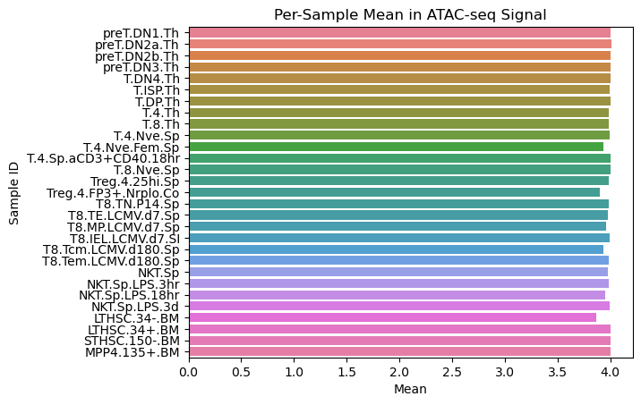
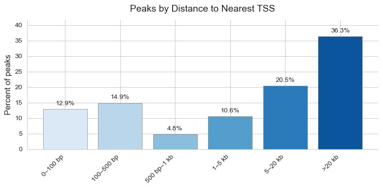
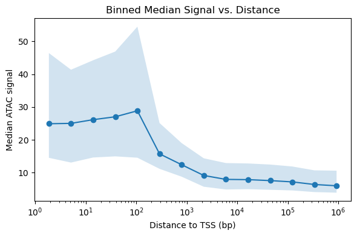
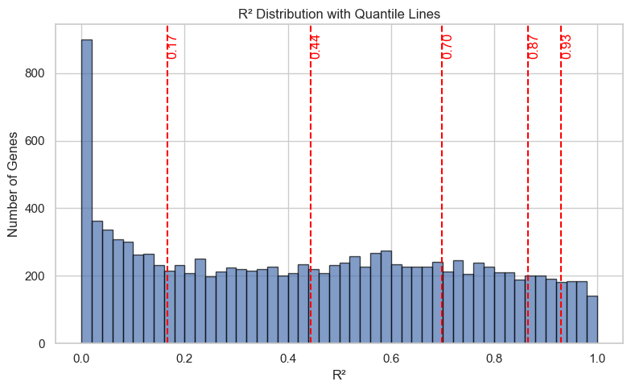
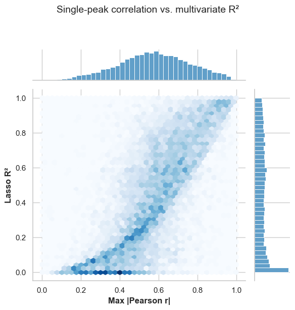
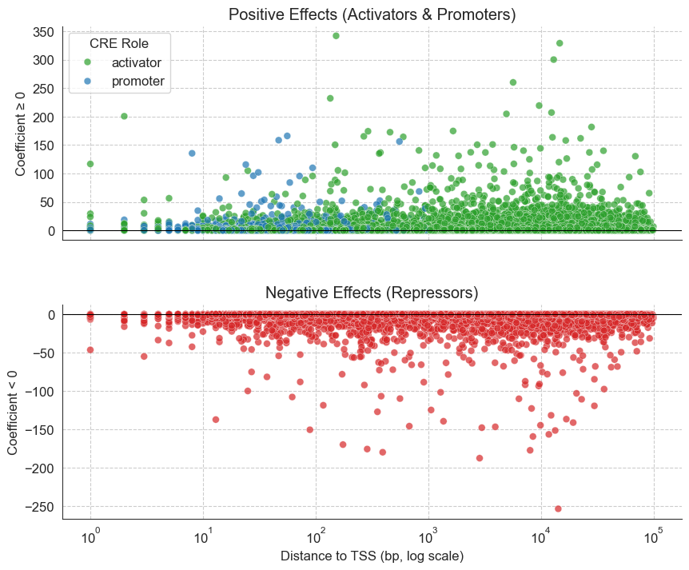
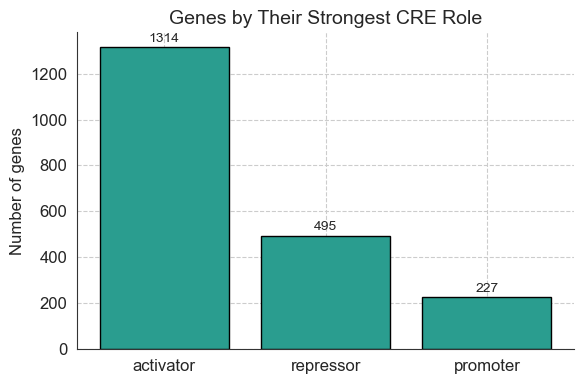
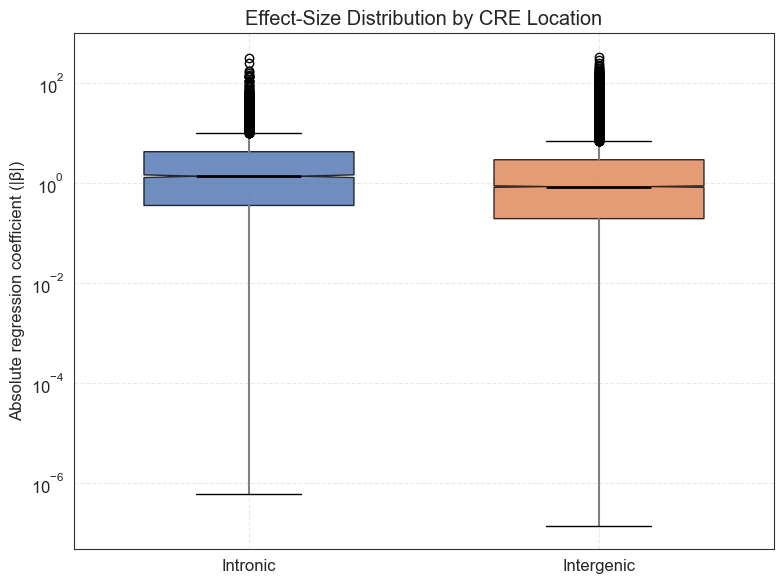

<h1 align="center">
   Determine Gene Regulation of Immune Cells  
   
  from Paired ATAC- and RNA-seq Data  
   
  <em>Group 2: abT & T.act cells</em>
</h1>

# 1. Overview

# 2. Project Description / Introduction
## **2.1 Immune Cell Types: αβ T Cells & Activated T Cells**

Our project focuses on two related immune cell types: αβ T cells (abT) and their activated counterparts (T.act). The specific cell types analyzed in this project were chosen based on their representation in the cis-regulatory atlas published by Yoshida et al. (2019), which serves as the foundational reference for our immune cell lineage structure.

  

  <figure style="flex: 1; margin: 0;">
    
    <figcaption><strong>Figure 1.</strong> <em>Full lineage map of mouse immune cells from:</em> 
    Yoshida, H., et al. (2019). <em>The cis–Regulatory Atlas of the Mouse Immune System.</em> Cell, 176(4), 897–912.e20.
    </figcaption>
  </figure>

  <figure style="flex: 1; margin: 0;">
    
    <figcaption><strong>Figure 2.</strong> <em>Highlighted subset of the Yoshida et al. lineage tree, showing only the abT and T.act cell branches analyzed in this project.</em></figcaption>
  </figure>

  

### <u>αβ T Cells (abT)</u>

<b>αβ T cells</b> are the major class of conventional T lymphocytes in the adaptive immune system. They express T-cell receptors (TCRs)composed of α and β chains, and differentiate into:

- **CD8⁺ cytotoxic T cells** — eliminate virus-infected or tumor cells  
- **CD4⁺ helper T cells** — secrete cytokines and coordinate immune responses

 Zhang, Y., et al. (2023).

### <u>Activated T Cells (T.act)</u>

Once stimulated by antigen, naive αβ T cells become activated and acquire effector functions:

- **Activated CD8⁺ T cells** become cytotoxic killers  
- **Activated CD4⁺ T cells** coordinate other immune cells via cytokine release

 Zhang, Y., et al. (2023)

---

### **2.2 ATAC-seq and RNA-seq: Purpose and Relevance**

To understand how abT and Tact cells regulate gene expression, we use data from two complementary technologies:

### <u> RNA-seq </u>

RNA sequencing measures gene expression by quantifying transcribed RNA molecules. It enables high-throughput, unbiased insights into:

- Cell differentiation
- Disease progression
- Functional genomics

However, RNA-seq alone does not reveal upstream chromatin structure or how gene expression is regulated.

### <u> ATAC-seq </u>

ATAC-seq (Assay for Transposase-Accessible Chromatin with sequencing) maps open chromatin regions by inserting sequencing adapters at accessible DNA sites using the Tn5 transposase.  

This lets us identify regulatory elements like promoters and enhancers.

Key advantages:
- Requires fewer cells
- Simpler, faster protocol
- High resolution of chromatin accessibility
- Allows inference of transcription factor binding and nucleosome positioning

The main idea is combining ATAC-seq and RNA-seq to allow us to reconstruct regulatory networks and track cell state transitions. In our study, this joint analysis helps us understand how different immune cell types specialize by using different regulatory DNA elements.

  

**Figure 3.** *Schematic of ATAC-seq signal logic and components.*
 
*Source: Yan, F., et al. (2020). From reads to insight: a hitchhiker’s guide to ATAC-seq data analysis. Genome Biology, 21(22).*

## **2.4 Research Goals**

**1.** Characterizing the chromatin landscape across immune cell lineages.

**2.** Tracing chromatin accessibility patterns and gene expression levels.

**3.** Constructing regression model to quantify OCR activity linked to gene expression.

**4.** Identifying regulatory elements involved in the transcriptional identity of αβ-T and T.act cells.

# 3. Dependencies

All dependencies used in this project are listed in the [`environment.yml`](./environment.yml) file.  

# 4. Project Organization
The notebooks used in this project can be found in the appendix section. 

# 5. Results

## **5.0 Initial Signal Assessment**

We assessed how chromatin signal varies across cell types and whether technical metrics like sequencing depth or number of input cells bias the data. While signal magnitude varied moderately across samples, no major outliers or systematic QC effects were observed. No filtering was applied based on these statistics.

  
  
  

**Figure 4.** *Total, median, and variability (CV) of signal across samples.*
 
**Notebook: Stats_Across_Peaks**

Each metric shows consistent global trends with no samples flagged for removal.

## **5.1 Filtered Out Genes Based On Variance and Confidence Score**

 
**Figure 5.** *Variance vs. -log10P for ATAC-seq peaks*  
**Notebook: ATAC-seq_filtering**

To focus on the most informative CREs, we filtered the ATAC-seq peaks based on two criteria:

(1) Low variance across cell types since uniformly accessible peaks (e.g., related to housekeeping genes) are less relevant for distinguishing regulatory programs. The cutoff was determined using the median absolute deviation (MAD) of per-peak variance.

 

(2) Low confidence scores, as assigned during peak calling, to exclude weak or potentially artifactual peaks.

## **5.2 TSS Distance Based Characterization of Peaks**
 
Distribution of peak distances and corresponding ATAC signal intensity

 

**Figure 6.** *Distribution of peaks by distance to the nearest TSS*  
**Notebook: TSS_distance_part1**

  

We analyzed the genomic distribution of ATAC-seq peaks based on their distance to the nearest transcription start site (TSS). The largest proportion of peaks is found either very close to the TSS (0–500 bp) or far away (>20 kb), with ~28% and ~36% respectively.

**Figure 7.** *Binned median ATAC signal by distance to TSS*  
**Notebook: TSS_distance_part1**

We also examined how the median ATAC signal varies with distance. Peaks located near the TSS show the highest accessibility signal, which rapidly decreases with increasing distance.

## **5.3 Clustering** 

As a way of analyzing how the chromatin landscape and gene expression pattern shape cell lines throughout differentiation, we plotted similarity matrices and ran a clustering analysis on our cell types. 

### **Similarity Matrices**

**Figure 8.** *Heatmap of pairwise Euclidean distances between genome-wide chromatin accessibility profiles for 29 cell lineages.*
 
**Notebook: compare_ATAC_RNA**

**Figure 9.** *Heatmap of pairwise Euclidean distances between gene expression profiles for 29 cell lineages.*
 
**Notebook: compare_ATAC_RNA**

The spearman's rank correlation coefficient between these two matrices is ρ = 0.637 (p = 1.3e-47), which means cell‐pairs that are close in chromatin accessibility tend also to be close in gene expression. 

### **Dimentionality Reduction and Clustering**

We used the elbow method to determine the optimal amount of clusters: k = 5

**Figure 10.** *UMAP of integrated RNA and ATAC data showcasing five distinct cell-type clusters.*
 
**Notebook: compare_ATAC_RNA**

This clustering subdivided our cells into the following subgroups:

| 0 | 1 | 2 | 3 | 4 |
|:--|:--|:--|:--|:--|
| <ul><li>T.4.Th</li><li>T.8.Th</li><li>T.4.Nve.Sp</li><li>T.4.Nve.Fem.Sp</li><li>T.4.Sp.aCD3+CD40.18hr</li><li>T.8.Nve.Sp</li><li>Treg.4.25hi.Sp</li><li>Treg.4.FP3+.Nrplo.Co</li><li>T8.TN.P14.Sp</li><li>T8.Tcm.LCMV.d180.Sp</li><li>T8.Tem.LCMV.d180.Sp</li><li>NKT.Sp</li><li>NKT.Sp.LPS.3hr</li><li>NKT.Sp.LPS.18hr</li><li>NKT.Sp.LPS.3d</li></ul> | <ul><li>LTHSC.34-.BM</li></ul> | <ul><li>preT.DN2b.Th</li><li>preT.DN3.Th</li><li>T.DN4.Th</li><li>T.ISP.Th</li><li>T.DP.Th</li></ul> | <ul><li>preT.DN1.Th</li><li>preT.DN2a.Th</li><li>LTHSC.34+.BM</li><li>STHSC.150-.BM</li><li>MPP4.135+.BM</li></ul> | <ul><li>T8.TE.LCMV.d7.Sp</li><li>T8.MP.LCMV.d7.Sp</li><li>T8.IEL.LCMV.d7.Gut</li></ul> |

Aiming to compare the clustering result to the established division of the cell types into the groups αβ-T, T.act and Progenitor, we ran the clustering with k = 3. The cell types were then subdivided as follows:

| 0                                                                                                                                                                                                                                                                                                                                                                                                                                                                                       | 1                                                                                                                                                                         | 2                                                                                                                                                                                                              |
|:----------------------------------------------------------------------------------------------------------------------------------------------------------------------------------------------------------------------------------------------------------------------------------------------------------------------------------------------------------------------------------------------------------------------------------------------------------------------------------------|:--------------------------------------------------------------------------------------------------------------------------------------------------------------------------|:---------------------------------------------------------------------------------------------------------------------------------------------------------------------------------------------------------------|
| <ul><li>T.DP.Th (abT)</li><li>T.4.Th (abT)</li><li>T.8.Th (abT)</li><li>T.4.Nve.Sp (abT)</li><li>T.4.Nve.Fem.Sp (abT)</li><li>T.8.Nve.Sp (abT)</li><li>Treg.4.25hi.Sp (abT)</li><li>T8.TN.P14.Sp (abT)</li><li>T8.Tcm.LCMV.d180.Sp (Tact)</li><li>T8.Tem.LCMV.d180.Sp (Tact)</li><li>NKT.Sp (abT)</li><li>NKT.Sp.LPS.3hr (Tact)</li><li>NKT.Sp.LPS.18hr (Tact)</li><li>NKT.Sp.LPS.3d (Tact)</li></ul> | <ul><li>preT.DN1.Th (abT)</li><li>preT.DN2a.Th (abT)</li><li>LTHSC.34-.BM (Progenitor)</li><li>LTHSC.34+.BM (Progenitor)</li><li>STHSC.150-.BM (Progenitor)</li><li>MPP4.135+.BM (Progenitor)</li></ul> | <ul><li>preT.DN2b.Th (abT)</li><li>preT.DN3.Th (abT)</li><li>T.DN4.Th (abT)</li><li>T.ISP.Th (abT)</li><li>T.4.Sp.aCD3+CD40.18hr (Tact)</li><li>Treg.4.FP3+.Nrplo.Co (abT)</li><li>T8.TE.LCMV.d7.Sp (Tact)</li><li>T8.MP.LCMV.d7.Sp (Tact)</li><li>T8.IEL.LCMV.d7.Gut (Tact)</li></ul> |

Although these clusters do not completely reproduce known relationships between cells, it does shows us that chromatin landscape and gene expression profiles are key elements in identifying cellular subgroups.

Take cluster 1, for example. It includes all progenitor cells and the two first pre-T cells that appear in the differentiation process. The chromatin and transcriptional profiles here are distinct enough to separate these cell types into the same cluster.

## **5.4 The Regression Model**

**Figure 11.** *Distribution of R² values across genes*
 
**Notebook: regression\_model**

This plot shows how much of the gene expression variance is explained by the CRE signals per gene. A considerable number of genes show low R² (poorly explained), while the rest are fairly evenly distributed, with the median R² around 0.44.

### **Comparison to Correlation-Based Approaches**

**Figure 12.** *Single-peak correlation vs. multivariate R²*
 
**Notebook: regression\_vs\_correlation**

This plot compares each gene’s maximum absolute Pearson correlation with its multivariate R² from the Lasso model. Most genes follow a general trend—higher max |r| leads to higher R²—but many lie above the r² curve, indicating added predictive power from combining multiple peaks. Others fall below it, where Lasso rejected spurious correlations. This highlights the benefit of multivariate modeling beyond simple associations.

### **Effect Sizes by CRE Role and Distance**

**Figure 13:** *Regression coefficients vs. distance to TSS*
 
**Notebook: enhancers\_promoters\_regression**

Activators and promoters show positive effects closer to the TSS, while repressors exert negative effects across a broader distance range.

### **CRE Distance Summary Statistics**

**Table 1:** *Summary statistics of CRE distances to TSS*  
**Notebook: enhancers\_promoters\_regression**

| Role      | Count  | Min | 25% | Median | 75%    | Max    |
| --------- | ------ | --- | --- | ------ | ------ | ------ |
| Activator | 13,685 | 1   | 418 | 4,448  | 15,948 | 99,778 |
| Promoter  | 2,036  | 0   | 26  | 53.5   | 108    | 983    |
| Repressor | 13,025 | 0   | 126 | 1,303  | 11,544 | 99,880 |

Repressing CREs are generally more distal than promoters but more proximal than activating CREs.

### **Genes Grouped by Strongest CRE Role**

**Figure 14.** *Genes grouped by dominant CRE role*  
**Notebook: enhancers\_promoters\_regression**

Most genes are primarily regulated by activating elements, but a substantial fraction are mainly repressed. A small number are primarily driven by promoter elements, some of which act as repressors.

### **Context-Dependent Regulatory Behavior**

We found that **2623 out of 21,249 CREs (12.3%)** act as **activators for some genes but repressors for others**, highlighting the **context-dependent nature** of regulatory elements.

### **Intronic vs. Intergenic Enhancers**

**Table 2:** *Overview of enhancer-type CREs by genomic location*
**Notebook: enhancers\_promoters\_regression**

| Location   | Count  | % of Enhancers | Activator Fraction | Repressor Fraction | Mean Coefficient | Median Coefficient | Max Coefficient |
| ---------- | ------ | -------------- | ------------------ | ------------------ | ---------------- | ------------------ | --------------- |
| Intergenic | 21,076 | 78.9%          | 0.486              | 0.514              | 3.85             | 0.87               | 342.0           |
| Intronic   | 5,634  | 21.1%          | 0.611              | 0.389              | 4.69             | 1.40               | 329.0           |

Most enhancers are intergenic, but intronic ones are more likely to act as activators and have slightly stronger regression coefficients on average.

### **Promoters Acting Through Repression**

We found that **23.8% of genes** (*n* = 1936) have a **promoter coefficient greater than the strongest repressor** linked to that gene.
**Notebook: enhancers\_promoters\_regression**

### **Effect Size Distributions by Location**

**Figure 15: Distribution of absolute effect sizes (|β|) across CREs by location**
**Notebook: enhancers\_promoters\_regression**

Intronic and intergenic enhancers show similar overall effect size distributions, with slightly higher median |β| in intronic elements.

### **Gene ontology analysis**

Using predefined gene clusters based on the RNAseq, we then assigned specific gene groups to either abT or T.act cells by looking at their mean expression. This allowed us to run a gene ontology (GO) term enrichment, in order to define the biological significance of the assigned genes. At first, the terms contained structures and processes that were too general. After filtering, abT gene clusters were still too general, however, the T.act cluster mirrored very specific aspects of its corresponding cell types - from abT cell activation to innate immune regulation and PPR signaling (Fig. 16). Therefore, gene ontology showed that RNAseq clustering, albeit not completely refined, did manage to describe important biological roles.

**Figure 16:** *Top gene ontology terms for T.act cells after filtering*
  
**Notebook: abT_Tact_gene_clusters**

## **6. Discussion**

We combined ATAC-seq and RNA-seq data to explore how cis-regulatory elements (CREs) shape immune cell identity across related immune cell lineages of *Mus musculus*. Our goal was to understand the regulatory logic behind gene expression differences in abT and T.act cells.

**Main findings:**

* Chromatin accessibility near TSS correlates with strong gene regulation.
* Regression modeling allowed classification of CREs as activators, repressors, or promoters.
* Most genes are driven by activators, but some are predominantly repressed.
* A subset of CREs can act as both activators and repressors depending on the gene.
* Functional clustering reflected known biology: general functions in abT, more specific immune roles in T.act.

---

**Limitations:**

* Strict peak filtering was needed due to computational limits and weak early signals.
* Some early methods (e.g. naïve promoter classification) were not robust.
* Cluster resolution may have been too coarse, requiring later gene filtering.

---

**Conclusion:**

Cis-regulatory landscapes differ subtly but meaningfully between related immune cell types. Our analysis shows that dynamic CRE activity programs cell fate decisions, linking chromatin state to the emergence of specialized gene expression profiles.

Future studies could integrate transcription factor motif analysis or single-cell resolution to uncover the upstream regulators driving these patterns and better resolve CRE behavior across developmental transitions. Moreover, this approach has offered promising results when it comes to distinguishing different types of immune-cell cancer (Corces et al., 2018). This in turn could further help study the underlying causes of abnormal gene expression and disrupted differentiation in transformed cells.

## 7. Resources 

1. Yoshida, H., et al. (2019). The cis-Regulatory Atlas of the Mouse Immune System. Cell, 176(4), 897–912.e20.

2. — Zhang, Y., et al. (2023). *T cell development and differentiation: insights from single-cell transcriptomics.* *Signal Transduction and Targeted Therapy*, **8**, 191. [https://doi.org/10.1038/s41392-023-01471-y](https://doi.org/10.1038/s41392-023-01471-y)

3. Assistance from AI tools was used throughout the project, particularly for code development and refining written formulations.

## 8. Appendix

**All Notebooks Used & What Each Contain:**

### **1. ATAC-seq_filtering**

Processes the raw ATAC-seq dataset by annotating cell types, filtering low-quality cells, and preparing it for downstream analysis through basic visual and statistical checks.

### **2. Stats_Across_Cells**

Performs preliminary statistical analysis on unfiltered ATAC-seq data across immune cell types to summarize accessibility distributions. These early results informed later filtering decisions.

### **3. Stats_Across_Peaks**

Computes descriptive statistics of accessibility across ATAC-seq peaks and summarizes cell type-specific patterns.

### **4. qc_vs_signal**

Assesses data quality by analyzing correlations between ATAC signal and quality control metrics. Finds minimal correlation, suggesting overall good data quality.

### **5. tss_distance_part1** and **tss_distance_part2**

In these notebook we computed each peak’s distance to its nearest TSS, plotted the distance distribution, merged in mean ATAC signal, and assesed & plotted the signal–distance relationship using pearson.

### **6. signal_comparison**

This notebook represents an early attempt to classify regulatory elements as promoters or enhancers based solely on their distance to the transcription start site (TSS). Although we were aware that such a naive distance-based classification would likely be insufficient, this trial allowed us to explore the feasibility of this approach. The method was not robust or conclusive and ultimately was not used in downstream analyses.

### **7. ATAC_Clustering_Analysis**

This notebook contains the main ATAC-seq clustering analysis, performed on the filtered dataset. We reduced dimensionality using PCA, UMAP, and t-SNE, and visualized the accessibility profiles across immune cell types. Clustering patterns were inspected to assess whether related cell types (specifically, progenitor, αβ T cells, activated T cells) group together based on their chromatin accessibility. This analysis directly addressed our goal of defining similarities and differences in chromatin landscapes between cell types.

### **8. gene_expression_clustering**
This notebook mirrors the ATAC-seq clustering approach, but applied to RNA-seq data. 

### **9. comparison_ATAC_RNA**

In this notebook, we directly compared ATAC-seq and RNA-seq clustering results by aligning the dimensionality reduction plots (PCA, UMAP, t-SNE) of both datasets side by side. We matched and renamed cell types across datasets to unify labels and enable visual comparison. The aim was to assess whether chromatin accessibility and gene expression reflect similar relationships between immune cell types, and to what extent their clustering patterns overlap or diverge.

### **10. abT_Tact_gene_clusters**

Clusters of high-variance genes are assigned to αβ T or activated T cells based on mean expression, followed by GO enrichment to interpret their biological roles. Initial GO terms were broad, so results were refined by focusing on biological processes, selecting the most significant genes, and filtering out general terms.

### **11. regression_model**

This notebook implements a regression-based model to identify potential regulatory relationships between chromatin accessibility at peaks (CREs) and gene expression. Using LASSO regression, the model links each gene to its nearby peaks and selects only those with non-zero coefficients, which may have a regulatory influence. We computed R² scores to estimate how well each gene's expression is explained by nearby CREs, enabling downstream analysis of regulatory strength across genes.

### **12. regression_vs_correlation**

This notebook compares the predictive power of correlation-based versus regression-based peak–gene associations. After filtering the peak–gene links for proximity and data availability, we visualized and quantified the overlap between methods. Additionally, we explored the direction of effect (positive/negative) of each CRE, separated them into putative activators and repressors, and analyzed whether clusters of peaks correlate with clusters of genes—potentially revealing coordinated regulatory programs.

### **13. enhancers_promoters_regression.ipynb**

This notebook investigates whether promoters and enhancers differ in their influence on gene expression using the results from LASSO regression. Peaks were annotated as promoters or enhancers based on their genomic distance to transcription start sites. We compared the regression coefficients and R² values between the two groups, examined the number of target genes per CRE type, and visualized distributions to assess whether regulatory strength differs between enhancers and promoters. This analysis helped characterize the functional roles of different cis-regulatory element classes.

### **14. CREs_per_cell_lineage**

This notebook quantifies how many unique cis-regulatory elements (CREs) regulate genes in each immune cell lineage. By combining the LASSO regression output with cell-type-specific gene expression, we identified peaks contributing to gene regulation in either abT or T.act cells. We then compared the distributions of these lineage-specific CREs to assess whether distinct sets of regulatory elements are used in different T cell lineages.

